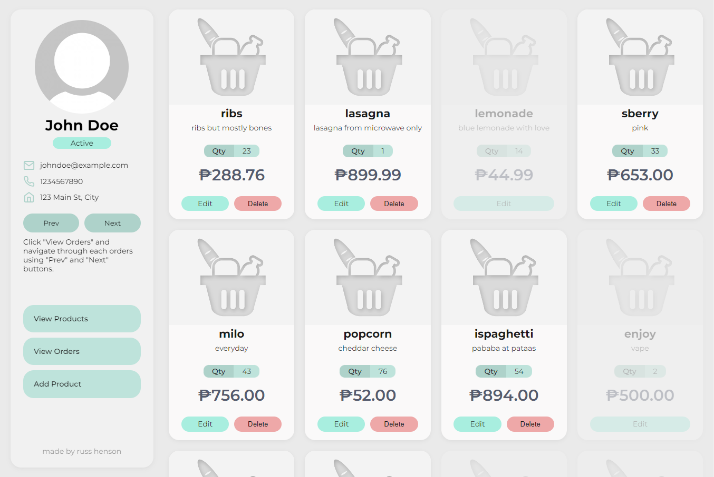
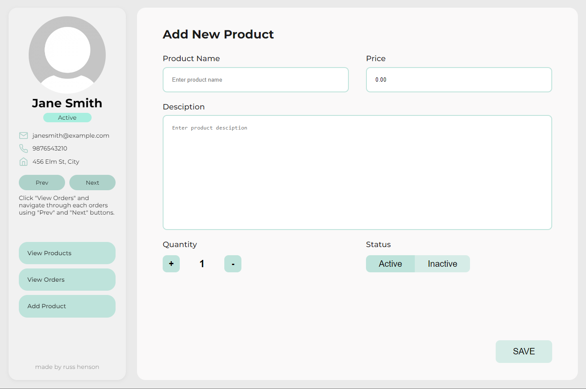
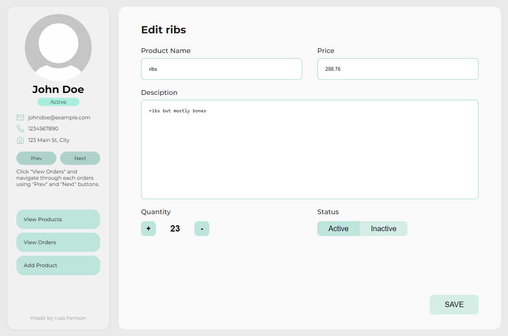
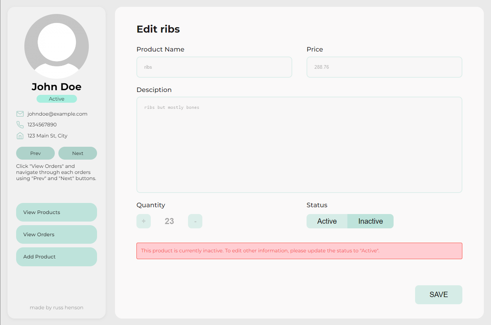
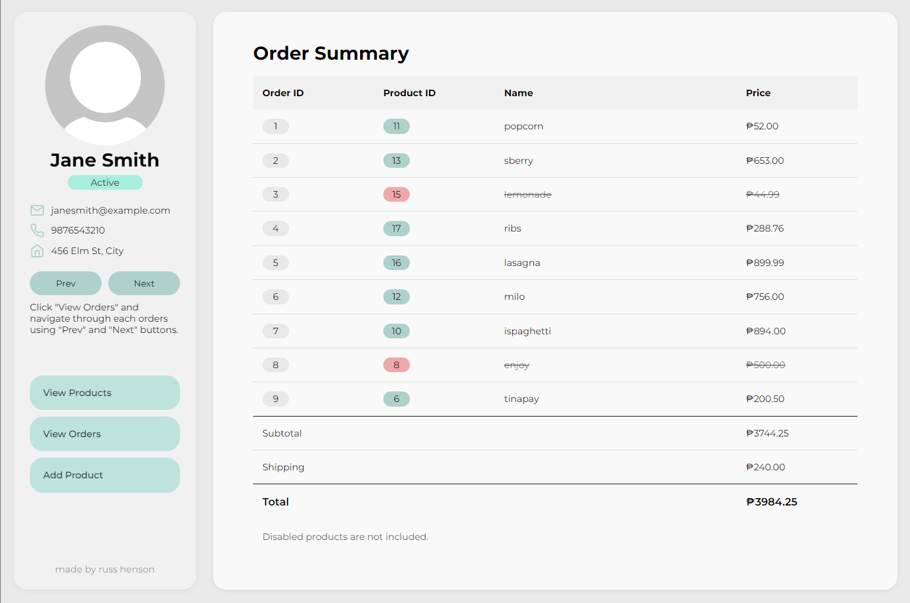
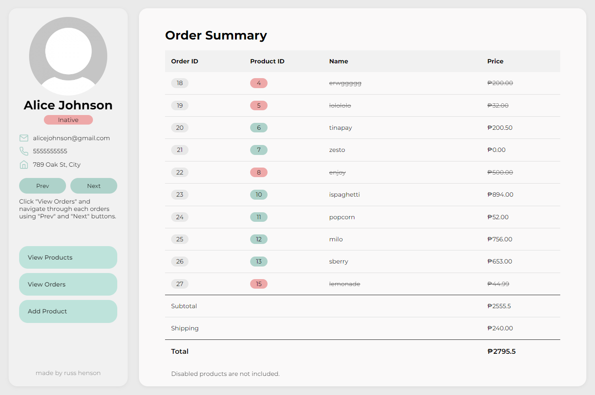

# Flower Store Exam Project

This project is an exam for FlowerStore.ph, a Vue.js project connected to a MySQL database using Node.js and Express. It provides CRUD functionalities for managing products, users, and orders. Follow the instructions below to set up and run the project on your local machine.

## Prerequisites

Before running the project, ensure that you have the following installed on your machine:

- Node.js: [https://nodejs.org](https://nodejs.org)
- MySQL: [https://www.mysql.com](https://www.mysql.com)

## Setup Instructions

1. Clone the repository to your local machine:**

   ```shell
   git clone <repository-url>

2. **Set up the MySQL database:**
   - Create a new database for the project in your local MySQL instance.
   - Import the SQL schema file provided with the project to set up the required tables.<br>

3. **Configure the backend connection:**
   - Navigate to the **backend** directory in the project folder.
   - Open the **config/database.js** file.
   - Update the database connection details with your MySQL database credentials (host, user, password, database name).<br>

4. **Install backend dependencies and start the server:**
   - This will start the backend server and connect it to your local MySQL database.

   ```shell
   cd backend
   npm install
   npm start

5. **Install frontend dependencies and start the Vue.js application:**

   ```shell
   cd frontend
   npm install
   npm run serve

## Functionality
The project provides the following CRUD functionalities:
   - View all products
   - Add a new product
   - Edit an existing product
   - Delete a product
   - Enable/disable products
   - View all users using pagination (Next and Previous buttons)
   - Navigate to each user's orders on the "View Orders" page

## Accessing the Project
To access and interact with the project, open your preferred web browser and navigate to http://localhost:8080. You will be able to view and use the various functionalities provided by the Flower Store exam project.

**Note:** The project is currently connected to a MySQL database running locally on your machine. Make sure you have set up the database and configured the connection details correctly before running the project.

Feel free to explore the project and make use of its features as required.

## Samples
1. **View Products Page**
   - All products are shown here including the disabled products.
   - The user can edit or delete any product by clicking the edit or delete buttons on each product card.
   - The user can only edit the disabled products. Deletion is not allowed.
   - The user profile and navigation of all pages are located on the sidebar.
     
2. **Add New Product Page**
   - By clicking, "Add Product" on the sidebar navigation, the user will redirect to this page.
   - The user can add a new product here by providing the details and saving the product.
     
4. **Edit Active Prouct**
   - By clicking, "edit" on an enabled product. The user will be redirected to the edit product page.
   - The user can edit any information regarding the product here.
     
6. **Edit Inactive Product**
   - The user can also choose to edit disabled products by clicking the "edit" button.
   - When editing a disabled product, only the status can be edited.
   - Once the status of a disabled product is set to "Active", the user can edit any information as well.
     
8. **User Order Summary Sample #1**
   - The order page can be accessed by clicking "View Orders" button on the sidebar.
   - The order summary page shows all the orders of the user, as well as the summary.
   - The subtotal is the total of all orders excluding the disabled products.
   - The shipping fee is randomly generated from 100-300 in increments of 5.
     
10. **User Order Summary Sample #2**
    - The user can navigate through all the order summary by clicking "next" or "prev" buttons on the sidebar.
    
12. **MySQL Database Snapshot**
    - Here's a snapshot of the database in MySQL Workbench.
      

Enjoy using the Flower Store Exam Project!
   
